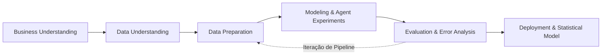
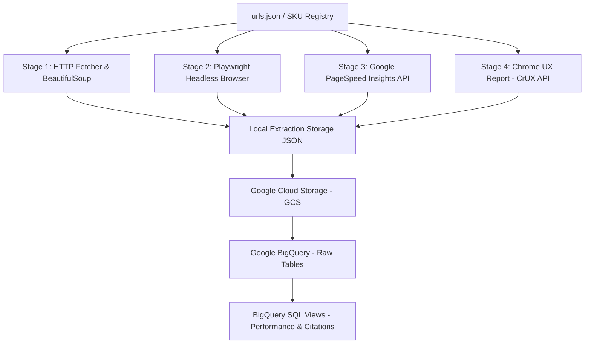
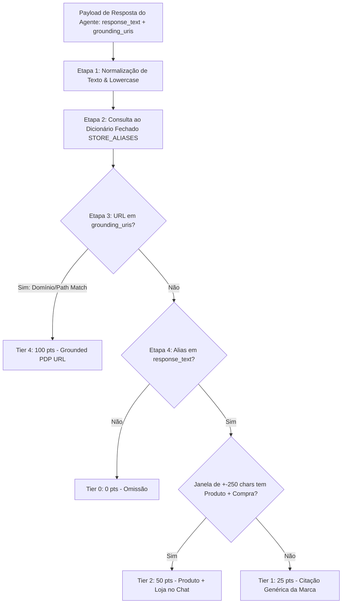
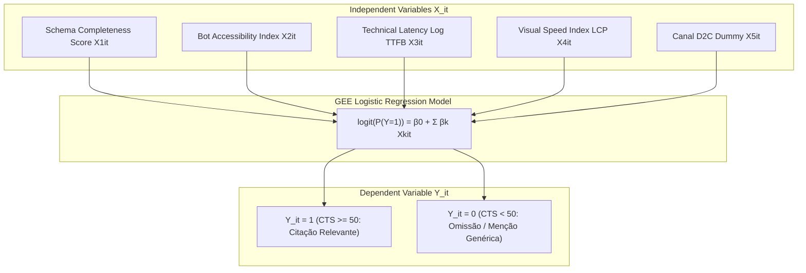

# 3. METODOLOGIA

A metodologia adotada neste trabalho fundamenta-se na combinação do ciclo de desenvolvimento de dados **CRISP-DM** (*Cross-Industry Standard Process for Data Mining*) com o protocolo experimental de avaliação de sistemas de busca baseados em Inteligência Artificial Generativa (*Agentic Commerce*). Este capítulo detalha o desenho metodológico, a especificação das categorias e lojas analisadas (incluindo marcas D2C de skincare e marketplaces), a arquitetura da pipeline de extração e ingestão de dados, o protocolo de análise de bloqueios e acessibilidade web, o tratamento via **Vistas SQL Nativas (*BigQuery Views*)** e *Data Warehouse* (Google BigQuery), a avaliação experimental dos agentes de IA (LLMs) e a formulação do modelo estatístico multivariado (**Agent Readiness Score — ARS**).

---

## 3.1 Desenho da Pesquisa e Ciclo de Vida (CRISP-DM)

A condução da pesquisa foi estruturada em seis fases iterativas adaptadas para o ecossistema de *Agentic E-commerce*:

1. **Compreensão do Negócio (*Business Understanding*)**: Identificação da transição do e-commerce tradicional (*Search & Click*) para o e-commerce mediado por agentes de IA (*Zero-Click Commerce* e desagregação do consumidor/comprador).
2. **Compreensão dos Dados (*Data Understanding*)**: Mapeamento de atributos críticos em *Product Detail Pages* (PDPs), incluindo marcações estruturadas (Schema.org / JSON-LD), performance técnica (Core Web Vitals via CrUX e PageSpeed Insights) e políticas de acesso a rastreadores (`robots.txt` e `llms.txt`).
3. **Preparação dos Dados (*Data Preparation*)**: Normalização de identificadores (slugificação de SKUs), estruturação de JSON de controle ([urls.json](file:///Users/evabettinaacostadepaula/thesisUSP/thesis-pipeline/urls.json)), pipelines de extração (HTML estático e headless browser com Playwright) e transformação de dados com Vistas SQL no BigQuery.
4. **Modelagem (*Modeling*)**: Configuração do protocolo experimental de chamadas aos agentes de IA (Vertex AI Gemini 2.5 Flash, Gemini 2.5 Pro) sob diferentes intenções de busca (marca, produto exato, genérica) e formulação do modelo estatístico de Regressão Logística.
5. **Avaliação (*Evaluation*)**: Verificação qualitativa e quantitativa dos resultados, medindo taxas de citação por loja, latência de resposta, alinhamento temporal (*Knowledge Cutoff*) e presença de *sycophancy* / alucinações.
6. **Implantação (*Deployment*)**: Consolidação dos artefatos de dados, dashboards analíticos e disponibilização da base histórica para replicabilidade acadêmica.



---

## 3.2 Protocolo de Seleção de SKUs e Canais de E-commerce

Para garantir a coerência metodológica e evitar o ruído de heterogeneidade entre categorias díspares (como a comparação entre produtos eletrônicos commoditizados e cosméticos), a pesquisa concentrou-se exclusivamente no setor de **Cuidados Pessoais e Beleza (Skincare)** no mercado brasileiro. O Brasil figura entre os três maiores mercados globais de cosméticos (ABIHPEC / Euromonitor), apresentando uma dinâmica única de alta densidade de redes farmacêuticas físicas concorrendo com a expansão acelerada de Marcas Nativas Digitais D2C (*Digital Native Vertical Brands*).

> **Nota de Delimitação Amostral e Fase Piloto**: Os dados coletados em execuções anteriores ao lançamento da versão `v2-protocolo-skincare` constituíram a **Fase Piloto Exploratória** (utilizada para testes diagnósticos de acessibilidade, validação da API e verificação de limites de conhecimento/*knowledge cutoff* na categoria de eletrônicos). A amostragem quantitativa longitudinal submetida à modelagem econométrica no Capítulo 4 compõe-se estritamente das execuções $t$ padronizadas sob o protocolo `v2-protocolo-skincare` (escopo 100% skincare, temperatura $T=0.0$, amostragem sem viés de indução e instrução neutra de sistema).

### Padronização do Cluster de Produtos (*Hero Product Cluster*)
Para evitar viés de precificação por volume ou variação de ativos químicos, a amostragem de SKUs foi estritamente padronizada em um único cluster funcional: **Séruns Faciais de Vitamina C / Antioxidantes (Volumetria padrão de 30ml/30g e concentração dermatológica entre 10% e 20%)**.

O dataset contempla 10 marcas estratégicas divididas entre D2C, Farma e Marketplaces:
1. **Sallve** (*Antioxidante Hidratante Vitamina C 35g* — Shopify DNVB)
2. **Creamy Skincare** (*Vitamina C Sérum 30g* — VTEX IO DNVB)
3. **Principia** (*VC-10 Sérum 10% Vitamina C + 0,5% Ácido Ferúlico 30ml* — Magento 2 DNVB)
4. **Beyoung** (*Sérum Vita C 18 30ml* — Shopify DNVB)
5. **ADCOS** (*Vitamina C 15 Oil Control 30ml* — VTEX FastStore D2C Marca)
6. **Dermage** (*Improve C 20 Biotic Sérum 30g* — VTEX Commerce D2C Marca)
7. **La Roche-Posay Brasil** (*Pure Vitamin C12 Sérum 30ml* — D2C Marca Global)
8. **Natura Brasil** (*Sérum Intensivo Antioxidante Chronos Vitamina C 15ml* — D2C Marca Nacional)
9. **O Boticário** (*Botik Sérum Vitamina C 10% 30ml* — D2C Marca Nacional)
10. **Neutrogena** (*Hydro Boost Water Gel 50g* — D2C Marca Global)

### Classificação dos Canais e Plataforma Referência (Shopify DNVB Benchmark)
Para manter o modelo econométrico parcimonioso e evitar complexidade desnecessária de escopo, a classificação de plataformas foca no motor **Shopify** (utilizado por referências DNVB como Sallve e Beyoung) como *benchmark* de arquitetura nativa Server-Side Rendering (SSR) e JSON-LD estruturado:
- **D2C Benchmark (Shopify DNVB)**: Lojas oficiais nativas digitais com SSR Liquid e Schema.org nativo.
- **Outros Canais Varejistas & Marketplaces**: Demais arquiteturas e e-commerces (VTEX, Magento, Marketplaces e redes farmacêuticas), analisados de forma agregada para contraste de performance.

---

## 3.3 Arquitetura da Pipeline de Ingestão de Dados (ETL)

A pipeline de ingestão opera em modelo híbrido e modularizado em Python, desacoplando a fase de rastreamento estático da simulação de navegadores dinâmicos.



### 3.3.1 Estágios de Extração
1. **Normalização e Slugificação (`Stage 1`)**:
   - Tratamento de caracteres especiais, remoção de acentuação gráfica e padronização dos SKUs em slugs únicos (ex: `natura-serum-intensivo-antioxidante-chronos-15ml-vitamina-c-15`).
   - Validação dos protocolos HTTPS e compilação do arquivo de mapeamento global `urls.json`.
2. **Extração de Conteúdo HTML e Marcadores Estruturados (`extract_content.py`)**:
   - Captura do HTML bruto via `requests` e parse com `BeautifulSoup`.
   - Inspeção de scripts do tipo `<script type="application/ld+json">` para verificação de esquemas Schema.org (`Product`, `Offer`, `AggregateRating`, `Brand`).
   - Mapeamento da presença de atributos essenciais: `name`, `price`, `priceCurrency`, `availability`, `brand`, `description`, `aggregateRating`, `image`, `sku`, `gtin`.
3. **Verificação de Acessibilidade a Bots e Arquivos de Protocolo**:
   - Checagem automática do arquivo `robots.txt` do domínio para verificar códigos de resposta HTTP (200 OK, 403 Forbidden, 404 Not Found) e presença de regras de bloqueio.
   - Teste de existência do protocolo emergente `llms.txt` na raiz do domínio (`https://dominio.com.br/llms.txt`).
4. **Extração de Desempenho Técnico e Regra de Imputação de Fallback (APIs CrUX e PageSpeed)**:
   - **Chrome User Experience Report — CrUX API (`extract_crux.py`)**: Fonte primária de **Dados de Campo (*Field Data*)** derivados de usuários reais do Chrome (percentis p75 de TTFB, LCP, CLS, INP).
   - **Google PageSpeed Insights API (`extract_pagespeed.py`)**: Fonte secundária de **Dados de Laboratório (*Lab Data / Lighthouse*)**.
   - **Regra de Imputação por Hierarquia de Fallback**: Caso uma marca D2C ou página de produto apresente volume de tráfego insuficiente no CrUX (retornando `NULL`), a pipeline aplica a regra de *fallback* automático, imputando as métricas sintéticas de laboratório do PageSpeed Insights (Lighthouse) e assinalando a flag binária de controle `is_crux_field_data = 0` (vs `1` para dados reais de campo).

### 3.3.2 Racional de Seleção das Bibliotecas Python
A escolha da pilha de pacotes em Python foi metodologicamente fundamentada nas exigências específicas de cada etapa da pesquisa:

| Pacote / Biblioteca | Função no Pipeline | Racional Técnico e Justificativa Metodológica |
| :--- | :--- | :--- |
| **`requests` + `urllib3`** | Extração HTTP síncrona leve | Baixa latência e alto throughput na captura de cabeçalhos estáticos, verificação de códigos WAF (403/429) e consumo das REST APIs do PageSpeed Insights e CrUX. |
| **`beautifulsoup4` (`bs4`)** | Parse do DOM HTML estático | Processamento tolerante a falhas na navegação na árvore DOM, otimizado especificamente para localizar e extrair blocos `<script type="application/ld+json">` sem a sobrecarga de execução de JavaScript. |
| **`playwright`** | Simulação Headless de SPAs | Automação de navegador Chromium headless para páginas dependentes de *Client-Side Rendering* (CSR / React / Next.js). Escolhido em detrimento do Selenium por operar via protocolo CDP com suporte assíncrono nativo, menor latência de inicialização e capacidade de interceptar requisições de rede. |
| **`google-cloud-bigquery` / `google-cloud-storage`** | Ingestão e Data Warehousing | SDKs oficiais da GCP para transferência em lote (*batch ingestion*) de arquivos JSON para o GCS e execução de DDL/DML de Vistas SQL Nativas no BigQuery. |
| **`google-genai` (Vertex AI SDK)** | Experimentos com LLMs | SDK enterprise nativo para comunicação programática com modelos Gemini 2.5 Flash/Pro, garantindo o controle determinístico dos parâmetros de temperatura ($T=0.0$) e a ativação/desativação do módulo *Google Search Grounding*. |
| **`pandas` + `numpy`** | Manipulação de Painéis e EDA | Operações vetoriais de alta performance para cálculo de estatísticas descritivas (média, mediana, IQR, *skewness* e taxas de inflação de zero-citação) e fusão de matrizes no painel final. |

---

## 3.4 Análise de Inacessibilidade, Bloqueios de Bots e Diretivas de IA

Um dos achados empíricos centrais do projeto residiu na identificação da **Arquitetura da Invisibilidade**: o insucesso no acesso a diversas lojas por ferramentas automatizadas de extração e por agentes de IA. A análise de inacessibilidade revelou três fatores determinantes:

### 1. Web Application Firewalls (WAF) e Proteções Anti-Bot
Lojas como **Mercado Livre**, **Amazon Brasil**, **Magazine Luiza** e **Americanas** utilizam soluções avançadas de segurança na borda (Cloudflare, Akamai Bot Manager, PerimeterX). Chamadas HTTP diretas por scripts convencionais de scraping recebem respostas HTTP 403 Forbidden ou 503, acompanhadas de desafios de JavaScript ou Captcha (*"Just a moment..."*). 

### 2. Bloqueio Explícito de Agentes de IA via `robots.txt`
A análise dos arquivos `robots.txt` de grandes marketplaces revelou a inclusão deliberada de diretivas `Disallow` direcionadas a rastreadores de inteligência artificial:
- **Amazon Brasil (`robots_amazon.txt`)**: Bloqueio ativo para `User-agent: Google-Extended`, `GPTBot`, `CCBot`, `ClaudeBot`, `PerplexityBot`, `Bytespider` e `Copilot` com `Disallow: /`.
- **Mercado Livre (`robots_mercadolivre2.txt`)**: Bloqueio total do domínio (`Disallow: /`) para rastreadores de IA como `PerplexityBot`, `ClaudeBot`, `GPTBot`, `ChatGPT-User` e `Amazonbot`.

| Loja / Dominio | HTTP Status robots.txt | Bloqueio GPTBot / CCBot / AI | Bloqueio Google-Extended | Inacessibilidade HTTP Direta |
| :--- | :---: | :---: | :---: | :---: |
| **Amazon Brasil** | 200 | **Sim (Disallow /)** | **Sim (Disallow /)** | Parcial (Captcha / WAF) |
| **Mercado Livre** | 200 | **Sim (Disallow /)** | Não (ausente do robots.txt) | Alta (403 / Captcha) |
| **Magazine Luiza** | 200 | Não (Sem restrição explícita) | Não | Média (403 em requests diretos) |

### 3. Validação Diagnóstica de SPAs e Navegador Headless (Playwright)
Para verificar se as limitações de acessibilidade decorriam da tecnologia de renderização *Client-Side* (CSR / React / Next.js) ou de regras ativas de firewall, executou-se um teste diagnóstico controlado utilizando **Playwright Engine** em Chromium headless (`scripts/test_playwright_bot.py`). O experimento empírico confirmou que firewalls como os do Mercado Livre disparam telas de desafio de segurança (CAPTCHA 403) mesmo sob automação de navegadores headless completos, comprovando que o bloqueio $X_2$ é imposto por regras de política de segurança da borda (WAF), e não por limitação técnica da ferramenta de captura.

---

## 3.5 Armazenamento em Nuvem e Engenharia de Atributos em Python (`pandas`)

Para viabilizar a análise estatística e a alimentação dos modelos econométricos em conformidade com as práticas do programa da USP, o **Google BigQuery** (dataset `thesisusp`) é utilizado estritamente como repositório bruto de armazenamento. Toda a camada de tratamento, desnestamento de JSONs, engenharia de atributos (*feature engineering*) e consolidação do painel longitudinal é executada integralmente em **Python**, utilizando as bibliotecas `google-cloud-bigquery` e `pandas`.

```mermaid
graph LR
    subgraph BigQuery Raw Storage
        A[thesisusp.content]
        B[thesisusp.crux]
        C[thesisusp.pagespeed]
        D[thesisusp.agent_responses]
        E[thesisusp.agent_citations]
    end

    subgraph Python Wrangling Layer (pandas / numpy)
        A & B & C --> F[df_store_performance]
        D & E --> G[df_agent_citations]
    end

    subgraph Analytical Panel DataFrame
        F & G --> H[df_panel_mart_ars]
    end
```

### Estrutura do Pipeline de Tratamento em Python:
1. **Leitura e Extração de Dados em Python (`df_store_performance`)**: Consumo das tabelas brutas via `bigquery.Client().query().to_dataframe()`, desnestamento de dicionários e cálculo da cobertura de campos do Schema.org (% de presença de preço, disponibilidade e marca) e percentis de latência CrUX (p75 TTFB e LCP) diretamente em `pandas`.
2. **Tratamento de Respostas dos Agentes (`df_agent_citations`)**: Parsing dos JSONs de resposta dos modelos Gemini em Python, tratamento de strings, deduplicação e vinculo entre prompts submetidos e citações observadas.
3. **Consolidação do DataFrame em Painel (`df_panel_mart_ars`)**: Junção (*merge*) das matrizes de características técnicas ($X_{it}$) com os vetores de citação dos agentes ($Y_{it}$) ao longo das execuções $t$, gerando a estrutura final de dados pronta para a modelagem com `statsmodels`.

---

## 3.6 Protocolo Experimental dos Agentes de IA e Grounding

O protocolo experimental de chamadas aos agentes de IA foi desenhado para testar a sensibilidade de recuperação (*retrieval sensitivity*) do modelo sob diferentes níveis de abstração semântica e literacia do consumidor, evitando a indução de marcas nos prompts.

### 3.6.1 Taxonomia de Prompts Não-Induzidos (*Unbiased Prompt Engineering*)
Para afastar vieses de indução (*Prompt Priming Bias*), a pesquisa não utiliza nomes de marcas nas perguntas genéricas e não assume uma jornada de busca linear. Os prompts são categorizados em três níveis independentes de abstração semântica:

1. **Nível 1 — Consulta Centrada no Problema (Zero-Knowledge / Alta Abstração — Controle)**:
   - *Prompt*: *"Tenho pele mista a oleosa com manchas e quero comprar online no Brasil um sérum facial de Vitamina C com ação antioxidante para uso diário. Quais marcas você recomenda e em quais e-commerces ou farmácias posso comprar hoje?"*
   - *Objetivo Metodológico*: Medir a **Descoberta Orgânica por RAG** (*Discovery & Grounding*). Avalia se marcas D2C emergem espontaneamente pela qualidade do seu conteúdo e marcação estruturada no Open-Web sem qualquer viés de marca.
2. **Nível 2 — Comparação de Canais em Linguagem Natural (Site da Marca vs. Varejo Farmacêutico)**:
   - *Prompt*: *"Quais são as melhores opções de sérum de Vitamina C para comprar direto no site da marca versus em grandes farmácias online no Brasil? Vale mais a pena comprar no site oficial ou na farmácia para ter cupom?"*
   - *Objetivo Metodológico*: Medir a **Preferência de Atribuição de Canal em Linguagem Natural**. Avalia se o agente prioriza a loja de fábrica (*"direto do site da marca"*) ou a rede farmacêutica sem usar jargões técnicos de e-commerce.
3. **Nível 3 — Atributos Funcionais e Restrições de Produto (Sem Indução de Marca Única)**:
   - *Prompt*: *"Qual é o melhor preço online hoje para um sérum facial de Vitamina C com concentração entre 10% e 15% e textura leve para pele oleosa, e em quais lojas online confiáveis eu encontro no Brasil?"*
   - *Objetivo Metodológico*: Medir o **Roteamento Comercial por Atributos**. Testa como a IA seleciona o canal de destino quando restrições funcionais (concentração, tipo de pele, preço e frete) são especificadas pelo consumidor sem forçar marcas específicas.

### 3.6.2 Desagregação do Funil Agentício e o Efeito de Deslocamento de Canal (Observação Qualitativa Exploratória)
Os testes empíricos de interface evidenciaram uma **desagregação estrutural e um deslocamento de canal na resposta do Gemini**, documentados via inspeção visual exploratória e capturas de tela arquivadas em `evidencias/`:
- **Superfície 1 — Janela de Chat Conversacional ($Y_{1i}$)**: Atua na fase de **Descoberta e Curadoria de Produtos**. Alimentada por Open-Web RAG e síntese vetorial. Concede menção de marca às lojas oficiais D2C no texto conversacional (ex.: *"Onde encontrar melhor preço: Drogasil e loja oficial da Principia"*).
- **Superfície 2 — Painel Lateral Gemini Shopping ($Y_{2i}$)**: Atua na fase de **Transação e Roteamento Comercial**. Alimentada por feeds da API do Google Merchant Center (GMC) e protocolos de inventário. **Desloca a conversão**, omitindo a loja oficial D2C das opções de compra e exibindo botões de oferta direcionados a marketplaces e farmácias concorrentes (ex.: Amazon, Beleza na Web, Farmácia Preço Popular, Droga Raia).

> **Ressalva Metodológica de Escopo**: A pesquisa não afere o volume de tráfego real (*click-through rate* — CTR) ou a conversão efetiva de vendas, uma vez que dados de cliques dos usuários são proprietários da plataforma. O estudo avalia estritamente a **fricção estrutural de visibilidade**: a omissão da loja oficial D2C do painel de transação impede a captura direta da venda no domínio próprio da marca.

```mermaid
flowchart TD
    subgraph 1. Chat Conversacional (Descoberta & RAG - Y1)
        A[Prompt Nível 1, 2 ou 3] --> B[Open-Web RAG & Schema.org Parse]
        B --> C[Citação de Marcas e Produtos no Texto Conversacional]
    end

    subgraph 2. Painel Lateral Shopping (Transação & GMC API - Y2 - Observação Qualitativa)
        C -->|Clique no Card / Intenção de Compra| D[Google Merchant Center API]
        D --> E[Fricção Estrutural: Omissão da Loja D2C & Roteamento para Marketplaces (Arquivado em evidencias/)]
    end
```

### 3.6.3 Sistema de Pontuação Hierárquica de Citação — CTS (Citation Tier Score)
Para resolver a sobreposição de citações e operacionalizar a variável dependente com rigor científico, formalizou-se o **Citation Tier Score (CTS)** — uma escala ordinal de 5 níveis (0 a 100 pontos):

| Nível de Citação | Denominação do Tier | Pontuação CTS | Critério Operacional & Regra Técnica | Fonte de Dados |
| :---: | :--- | :---: | :--- | :--- |
| **Tier 4** | **URL Efetiva de PDP Grounded** | **100 pts** | A URL exata da PDP monitorada é indexada e retornada nos metadados de busca (`grounding_chunks`). | `grounding_uris` (`web.uri`) |
| **Tier 3** | **Oferta no Sidebar Shopping (não instrumentado via código)** | **75 pts** | A loja aparece com oferta ativa e botão de compra no painel lateral do Gemini Shopping ($Y_{2i}$ — observação qualitativa exploratória — §3.6.2). | Inspeção Visual Exploratória (`evidencias/`) |
| **Tier 2** | **Citação de Produto + Loja no Chat** | **50 pts** | O nome do produto E a loja de destino específica são citados no texto do chat ($Y_{1i}$ em janela de $\pm 250$ chars). | Regex & Token Context em `response_text` |
| **Tier 1** | **Citação Genérica da Marca** | **25 pts** | Apenas o nome da marca/fabricante é mencionado sem atribuição de loja ou produto específico no contexto local. | Regex em `response_text` |
| **Tier 0** | **Omissão / Zero Citação** | **0 pts** | A loja/marca é completamente ignorada ou omitida pelo agente de IA. | Nenhuma citação observada |

O metric **CTS** quantifica a riqueza da citação para análises descritivas do Deslocamento de Canal. Para a modelagem econométrica multivariada, aplica-se a **Regra de Binarização**:
$$Y_{it} = \begin{cases} 1, & \text{se } \text{CTS}_{it} \ge 50 \text{ (Tier 2, 3 ou 4 — Citação Relevante de Canal)} \\ 0, & \text{se } \text{CTS}_{it} < 50 \text{ (Tier 0 ou 1 — Omissão ou Menção Genérica)} \end{cases}$$

#### Algoritmo de Extração e Mapeamento de Aliases (`STORE_ALIASES`)
A classificação automatizada das respostas dos agentes nos Tiers do CTS é executada via script em Python (`scripts/load_to_bigquery.py`), seguindo um protocolo de cinco etapas estritamente auditável:



1. **Etapa 1 — Normalização e Extração de Entidades**: O texto da resposta (`response_text`) e a lista de URLs recuperadas no grounding (`grounding_uris`) são convertidos para caracteres minúsculos, eliminando ruídos de formatação.
2. **Etapa 2 — Consulta ao Dicionário Fechado de Aliases (`STORE_ALIASES`)**: Para cada uma das 10 marcas D2C monitoradas e dos 11 canais varejistas/marketplaces, o algoritmo consulta um dicionário fechado com os nomes oficiais, variações de escrita e domínios da web (ex.: `Sallve` $\rightarrow$ `["sallve", "sallve.com.br", "loja sallve"]`; `Principia` $\rightarrow$ `["principia", "principia.com.br", "principiaskin"]`; `Creamy` $\rightarrow$ `["creamy", "creamy.com.br", "loja creamy"]`).
3. **Etapa 3 — Avaliação do Tier 4 (Grounded URI)**: O algoritmo verifica se qualquer URL retornada em `grounding_uris` contém o padrão de domínio/caminho da loja (`/{alias}`, `.{alias}.`, `={alias}`). Havendo correspondência $\implies$ **Tier 4 (100 pts)**.
4. **Etapa 4 — Avaliação de Vizinhança de Contexto para Tier 2 vs Tier 1 (Janela de $\pm 250$ caracteres)**: Para cada ocorrência do alias no texto conversacional, inspeciona-se uma janela local de $\pm 250$ caracteres:
   - Se a janela contiver **tokens de produto** (`vitamina c`, `sérum`, `30ml`, `35g`, `hydro boost`, `chronos`, `vc-10`) **E** **tokens de intenção de compra/preço** (`r$`, `reais`, `preço`, `comprar`, `site oficial`, `cupom`, `oferta`) $\implies$ **Tier 2 (50 pts — Citação de Produto + Loja)**.
   - Se o alias for mencionado sem essa combinação no contexto local $\implies$ **Tier 1 (25 pts — Menção Genérica da Marca)**.
5. **Etapa 5 — Aplicação da Regra de Binarização para Regressão ($Y_{it}$)**:
   - Atribui-se $Y_{it} = 1$ para todas as observações com $\text{CTS}_{it} \ge 50$ (Tiers 2, 3 ou 4).
   - Atribui-se $Y_{it} = 0$ para observações com $\text{CTS}_{it} < 50$ (Tiers 0 ou 1).

### 3.6.4 Modelos Avaliados, Instrução de Sistema e Hiperparâmetros Vertex AI
As chamadas aos agentes foram executadas via **Google Cloud Vertex AI SDK**, testando 4 configurações experimentais padronizadas para garantir consistência em todas as rodadas $t$:
1. **`gemini-2.5-flash`**: Modelo leve e otimizado para resposta rápida (Memória Paramétrica pura).
2. **`gemini-2.5-pro`**: Modelo avançado focado em raciocínio complexo (Memória Paramétrica pura).
3. **`gemini-2.5-flash-grounded`**: Gemini 2.5 Flash com **Google Search Grounding** ativo (`types.Tool(google_search=types.GoogleSearch())`).
4. **`gemini-2.5-pro-grounded`**: Gemini 2.5 Pro com **Google Search Grounding** ativo (`types.Tool(google_search=types.GoogleSearch())`).

#### Parâmetros de Execução e Instrução de Sistema (*System Instruction*)
Para garantir a reprodutibilidade dos experimentos e afastar contaminações de papel artificial (*Persona Contamination Bias*), fixaram-se rigorosamente as seguintes configurações na API `GenerateContentConfig`:
- **`system_instruction` (Instrução Neutra de Sistema)**:
  `"Você é um assistente virtual conversacional. Responda às dúvidas do usuário em português do Brasil de forma clara, objetiva e fundamentada em informações precisas da web."`
  *Justificativa Metodológica*: Preserva o comportamento orgânico conversacional padrão do Gemini frente a consumidores reais, evitando forçar personas de compras ou formatos artificiais de JSON que distorceriam a distribuição natural de respostas.
- **`temperature = 0.0`**: Decodificação determinística (gananciosa), eliminando ruídos de amostragem estocástica entre execuções repetidas no tempo $t$.
- **`location = "us-central1"`**: Endpoint de infraestrutura corporativa do Vertex AI SDK.

### 3.6.5 Efeito da Memória Paramétrica vs. Google Search Grounding
Os experimentos revelaram a diferença crítica entre o conhecimento congelado e o rastreamento em tempo real:
- **Sem Search Grounding (Memória Paramétrica)**: O modelo responde baseado unicamente no seu corpus de pré-treino, omitindo disponibilidade de estoque e dados em tempo real de lojas D2C.
- **Com Search Grounding (Grounded)**: A ativação da busca em tempo real permite a recuperação dinâmica de preços, links de checkout e ofertas atualizadas de séruns de Vitamina C no Brasil, alterando dramaticamente quais lojas são citadas no vetor final de resposta.

---

## 3.7 Especificação do Modelo Estatístico (Agent Readiness Score — ARS)

Para medir quantitativamente o impacto marginal dos fatores técnicos da página sobre a probabilidade de uma loja no tempo $t$ obter citação relevante ($\text{CTS}_{it} \ge 50 \implies Y_{it} = 1$), formalizou-se o modelo estatístico multivariado de **Regressão Logística Binomial via Equações de Estimativa Generalizadas (GEE)** com matriz de correlação de trabalho autorregressiva AR(1) agrupada por loja ($i$).

### 3.7.1 Formulação Matemática

A probabilidade $P(Y_{it} = 1 | \mathbf{X}_{it})$ de a loja $i$ no tempo $t$ ser recomendada é fundada na função logística:

$$\operatorname{logit}(P(Y_{it} = 1)) = \ln\left(\frac{P(Y_{it} = 1)}{1 - P(Y_{it} = 1)}\right) = \beta_0 + \beta_1 X_{1it} + \beta_2 X_{2it} + \beta_3 X_{3it} + \beta_4 X_{4it} + \beta_5 X_{5it}$$

Onde $Y_{it}$ é a variável dependente binária de citação relevante ($\text{CTS}_{it} \ge 50 \implies 1$; caso contrário $\implies 0$).

### 3.7.2 Variáveis Independentes ($\mathbf{X}_{it}$)
1. **$X_{1it}$ (Schema Completeness Score)**: Proporção contínua de 0 a 1 de presença dos campos essenciais do Schema.org no JSON-LD da página (nome, preço, moeda, disponibilidade, marca, gtin).
2. **$X_{2it}$ (Bot Accessibility Index)**: Variável dummy binária ($1 =$ Loja acessível sem bloqueio WAF 403; $0 =$ Loja com bloqueio WAF na borda).
3. **$X_{3it}$ (Technical Latency Index — $\ln(\text{TTFB})$)**: Logaritmo natural do Time to First Byte em ms (dados de campo CrUX p75 com fallback de laboratório PageSpeed quando o CrUX for nulo).
4. **$X_{4it}$ (Visual Speed Index — LCP)**: Tempo de carregamento do maior elemento visual em segundos (Largest Contentful Paint p75 via CrUX/PageSpeed).
5. **$X_{5it}$ (Canal D2C Dummy)**: Variável binária de canal ($1 =$ Loja D2C de Marca / DNVB; $0 =$ Marketplace / Varejo Farmacêutico).



### 3.7.3 Construção do Agent Readiness Score (ARS)
O **Agent Readiness Score (ARS)** é obtido pela transformação logística das probabilidades preditas pelo modelo estimado, normalizado em uma escala de 0 a 100:

$$\text{ARS}_{it} = \frac{1}{1 + e^{-(\hat{\beta}_0 + \sum_{k=1}^5 \hat{\beta}_k X_{kit})}} \times 100$$

Esta métrica sintética fornece aos gestores de produto (*Product Managers*) e equipes de e-commerce um indicador direto e acionável da prontidão técnica de sua loja para competir na era do *Agentic Commerce*.

---

## 3.8 Resumo das Etapas da Metodologia

A Tabela abaixo sumariza a articulação entre os objetivos específicos da metodologia, as ferramentas utilizadas e os artefatos gerados no projeto:

| Etapa Metodológica | Ferramentas / Tecnologias | Artefatos Gerados |
| :--- | :--- | :--- |
| **1. Mapeamento & Seleção** | Python (`urls.json`), RegExp | Amostra de SKUs e lojas (Skincare D2C, Varejo Farmacêutico e Marketplaces) |
| **2. Extração & Raspagem** | Requests, BeautifulSoup, APIs CrUX e PageSpeed | Arquivos JSON brutos em `extractions/` e tabelas no BigQuery |
| **3. Análise de Inacessibilidade** | HTTP Status Checkers, Parser `robots.txt`, `llms.txt`, Playwright Diagnóstico | Diagnóstico de WAF (Cloudflare/Akamai), SPAs e diretivas `Disallow` |
| **4. Transformação de Dados** | Python (`pandas`, `numpy`), BigQuery Storage | DataFrames `df_store_performance`, `df_agent_citations` e `df_panel_mart_ars` |
| **5. Protocolo de Agentes de IA** | Vertex AI (Gemini 2.5 Flash / Pro), Google Search Grounding | Tabela `agent_responses` e métricas de citação/latência |
| **6. Modelagem Estatística** | Python (`statsmodels`), Regressão Logística GEE | Coeficientes $\hat{\beta}_k$, Odds Ratios e o indicador **ARS** |

---
