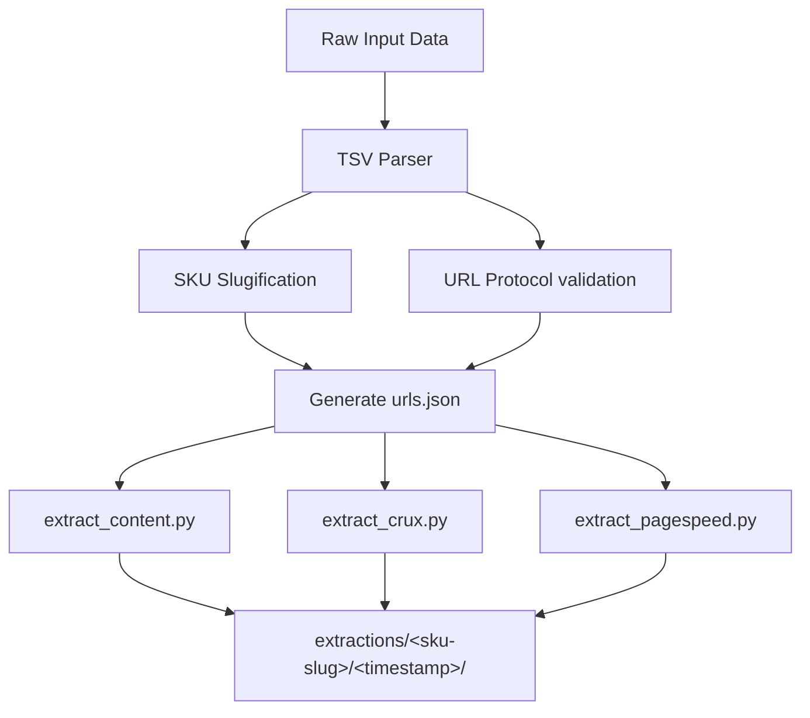

# First Stage of Extraction: Normalization, HTTPS, and Parsing

This document details the architecture, rules, and logic implemented during the **First Stage of Extraction** in this project. This stage is responsible for parsing raw product data, normalizing identifiers and URLs, and generating the structured [urls.json](file:///Users/evapaula/mba_thesis/urls.json) file that drives the downstream extraction scripts.

---

## 1. Overview of the Pipeline

The extraction pipeline operates in two major phases:
1. **Stage 1 (Parsing & Normalization)**: Raw TSV/tabular data is parsed, cleaned, and compiled into [urls.json](file:///Users/evapaula/mba_thesis/urls.json).
2. **Stage 2 (Automated Extraction)**: Specialized Python scripts in the `scripts/` directory read from [urls.json](file:///Users/evapaula/mba_thesis/urls.json) and query various APIs and page contents.



---

## 2. SKU Normalization (Slugification)

Downstream extraction scripts group data files inside directories named after each SKU. To prevent filesystem compatibility issues (e.g., spaces, special characters, accented characters), raw SKU titles are normalized into clean **slugs**.

### Slugification Logic:
1. **Remove SKU Prefixes**: Regular expressions identify and strip any leading indices such as `SKU X — ` or `SKU X - `.
2. **Lowercase Conversion**: All characters are converted to lowercase.
3. **Accent Removal**: Diacritics are mapped to their ASCII equivalents (e.g., `á` $\rightarrow$ `a`, `ç` $\rightarrow$ `c`).
4. **Special Character Stripping**: Any character that is not alphanumeric, a hyphen, or a space is removed (e.g., parentheses).
5. **Dashing**: Spaces and consecutive hyphens are replaced by a single hyphen `-`.

### Example Mapping:
| Raw SKU Input | Slug Key | Target Folder Name |
| :--- | :--- | :--- |
| `SKU 1 — iPhone 17 Pro` | `iphone-17-pro` | `extractions/iphone-17-pro/` |
| `SKU 4 — Natura Sérum Intensivo Antioxidante Chronos 15ml (Vitamina C 15%)` | `natura-serum-intensivo-antioxidante-chronos-15ml-vitamina-c-15` | `extractions/natura-serum-intensivo-antioxidante-chronos-15ml-vitamina-c-15/` |

---

## 3. URL Normalization & HTTPS Enforcement

During parsing, URLs are validated to ensure they can be fetched without errors by standard Python libraries (like `requests`).

> [!WARNING]
> If a URL is specified as `domain.com.br/path`, standard libraries will raise a `MissingSchema` exception. The parser resolves this by explicitly validating the protocol.

### URL Normalization Rules:
- If a URL does not start with `http://` or `https://`, the pipeline automatically prepends `https://`.
- No modifications are made to trailing slashes or URL query parameters to preserve tracking IDs and page state.

### Examples:
- `natura.com.br/p/...` $\rightarrow$ `https://natura.com.br/p/...`
- `laroche-posay.com.br/...` $\rightarrow$ `https://laroche-posay.com.br/...`

---

## 4. Parser & JSON Schema (`urls.json`)

The parser maps input columns to a structured JSON format. 

### Mapping Scheme:
- **Canal (Channel)** $\rightarrow$ `"store"`
- **Tipo (Type)** $\rightarrow$ `"type"` (optional, omitted if not provided)
- **URL** $\rightarrow$ `"url"`

### JSON Schema structure:
```json
{
  "<sku-slug>": [
    {
      "store": "Store Name",
      "url": "https://store-url.com",
      "type": "Optional Store Type (e.g. D2C marca, Marketplace)"
    }
  ]
}
```

---

## 5. Integration with Downstream Scripts

The output of the first stage directly controls the behavior of:
- [extract_content.py](file:///Users/evapaula/mba_thesis/scripts/extract_content.py)
- [extract_crux.py](file:///Users/evapaula/mba_thesis/scripts/extract_crux.py)
- [extract_pagespeed.py](file:///Users/evapaula/mba_thesis/scripts/extract_pagespeed.py)

Each script loops through the keys of the JSON file:
```python
with open(urls_file, "r") as f:
    skus_data = json.load(f)

for sku, urls in skus_data.items():
    sku_dir = os.path.join(extractions_dir, sku, today_str)
    os.makedirs(sku_dir, exist_ok=True)
    # ... executes extraction for each url ...
```
By keeping the SKU slug as the dictionary key, folders are generated cleanly without spaces, parentheses, or non-ASCII characters.
