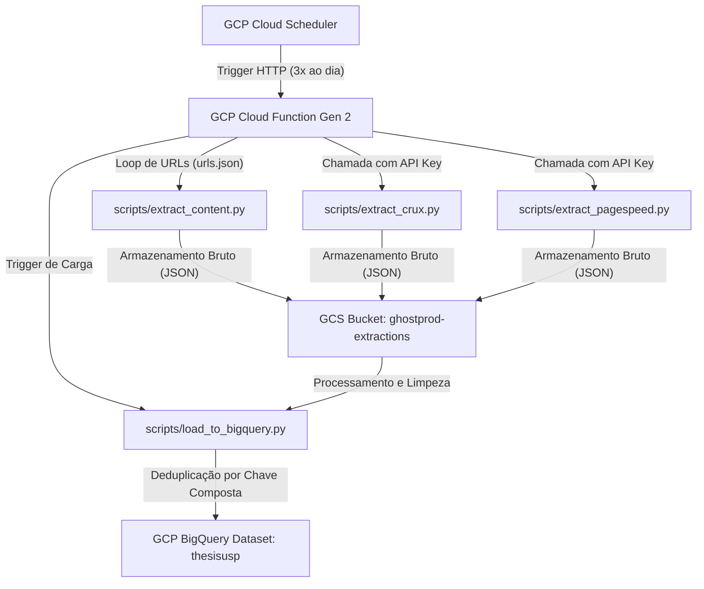

# Dossiê Técnico e Roteiro de Publicações: Pipeline Serverless de E-commerce, Engenharia Anti-Bot e Auditoria de LLMs

Este documento serve como um **guia técnico completo e detalhado** do projeto desenvolvido para a sua tese de MBA da USP. Ele contém todas as informações arquiteturais, códigos, dados estatísticos reais das tabelas, logs do experimento de evasão de bot, a lógica de pivotagem para o ecossistema do Google Gemini e como isso se conecta com a metodologia científica.

Você pode usar este material para publicar uma série extensa de artigos técnicos no LinkedIn, dividindo-os nos tópicos sugeridos abaixo.

---

# 📚 Índice da Série de Publicações

1. **Artigo 1: A Arquitetura e o Pipeline de Dados Serverless na GCP**
2. **Artigo 2: O Diagnóstico dos Bloqueios e a Auditoria dos Dados no BigQuery**
3. **Artigo 3: Engenharia Avançada de Raspagem: A Ilusão das SPAs e o Limite do Playwright Stealth**
4. **Artigo 4: O Pivot para Multi-Modelos Google Gemini e a Ciência da Factualidade**
5. **Artigo 5: O Guia de Implementação e Automação de Ponta a Ponta**

---

# 🚀 Artigo 1: A Arquitetura e o Pipeline de Dados Serverless na GCP

### 💡 Foco do Post:
*Explicar a arquitetura técnica de ingestão, processamento e carga incremental, destacando a eficiência de custos e o conceito serverless.*

### 🛠️ Detalhamento Arquitetural:
O objetivo deste pipeline é coletar dados em tempo real de três fontes principais para 7 SKUs monitorados em 15 lojas concorrentes:
1. **Dados de Conteúdo (`content`)**: Títulos de página, meta-descrições, tags H1, dados estruturados (schema.org na especificação JSON-LD) e o arquivo `llms.txt` (que dita regras de acesso para robôs de IA).
2. **Métricas de Usuários Reais (`crux`)**: Dados de campo fornecidos pelo Chrome UX Report API (LCP, CLS, INP, FCP, TTFB) para Desktop e Mobile.
3. **Métricas de Auditoria Simulada (`pagespeed`)**: Pontuação de performance e auditorias de laboratório fornecidas pelo Google PageSpeed Insights API.

#### Fluxo de Dados (Mermaid):


### 💻 Especificações do Código e Engenharia:
* **Deduplicação Inteligente**: O script de carga no BigQuery (`load_to_bigquery.py`) utiliza uma chave composta baseada no trio `(run_str, sku, store)` para garantir a idempotência da carga. Se o pipeline for reexecutado na mesma hora, ele não duplicará linhas na tabela final.
* **Residência de Dados**: O dataset do BigQuery foi provisionado na região **`southamerica-east1` (São Paulo)** para garantir conformidade com latência local e residência de dados nacionais.
* **Runtime e Recursos**: Cloud Function rodando em ambiente **Python 3.12 (Gen 2)**, com limite de memória estendido para **1GiB** e tempo limite (timeout) estendido para **3600 segundos (1 hora)** para suportar o processamento assíncrono dos modelos e APIs.

---

# 🛡️ Artigo 2: O Diagnóstico dos Bloqueios e a Auditoria dos Dados no BigQuery

### 💡 Foco do Post:
*Apresentar os dados reais obtidos pela auditoria exploratória no BigQuery, revelando como grandes marcas e varejistas tratam o tráfego automatizado.*

### 📊 Estatísticas Reais do Dataset (Coleta de 04/06/2026 a 23/06/2026):
Após 60 execuções diárias automáticas na nuvem, a auditoria de qualidade de dados no BigQuery revelou a seguinte tabela de bloqueios (WAF Block Rate) por canal:

| Loja / Canal | Tipo de Canal | Total de Requisições | Requisições Bloqueadas | Taxa de Bloqueio (%) | Assinatura do Título / Resposta |
| :--- | :--- | :---: | :---: | :---: | :--- |
| **Magazine Luiza** | Varejo/Marketplace | 118 | 118 | **100%** | `"Just a moment..."` (Cloudflare) |
| **Cosmetis** | Especialista Skincare | 59 | 59 | **100%** | `"Access Denied"` (WAF 403) |
| **Vivo** | Operadora/Varejo | 177 | 177 | **100%** | `"Just a moment..."` (Cloudflare) |
| **Mercado Livre** | Marketplace | 236 | 235 | **99.58%** | `"Mercado Livre"` (Bloqueio Dinâmico) |
| **Fastshop** | Varejo Especialista | 59 | 53 | **89.83%** | `"Access Denied"` (WAF 403) |
| **Samsung** | D2C Marca (Galaxy S26) | 59 | 59 | **100%** | `"Access Denied"` (WAF 403) |
| **Samsung** | D2C Marca (Motorola) | 59 | 0 | **0%** | Página aberta com sucesso |
| **Amazon Brasil** | Marketplace | 295 | 104 | **35.25%** | `"Amazon.com.br"` (CAPTCHA Intermitente) |
| **Apple Brasil** | D2C Marca | 61 | 0 | **0%** | Sucesso (Página aberta) |
| **Natura / Boticário**| D2C Marcas | 118 | 0 | **0%** | Sucesso (Página aberta) |

### 🔍 Achados Analíticos Importantes:
1. **O Bloqueio Intermitente da Amazon**: A taxa de 35.25% de bloqueio indica um sistema de **Rate Limiting baseado em IP e tempo de sessão**. As primeiras requisições do loop de extração passam, mas à medida que o script faz chamadas consecutivas à Amazon na mesma hora a partir do mesmo IP, o firewall ativa a tela de CAPTCHA.
2. **O Mistério da Samsung**: O canal Samsung D2C bloqueou 100% das requisições para o Galaxy S26, mas bloqueou 0% para o Motorola Edge. Isso mostra que as regras de segurança podem ser aplicadas de forma **específica por página de categoria ou SKU** de alta concorrência.
3. **Auditoria de Qualidade**: Algumas requisições no Boticário D2C retornaram o título `"Access Denied"` com 12 palavras, mas foram classificadas inicialmente como sucesso pelo script básico que exigia apenas `word_count > 10`. A EDA serviu para calibrar o algoritmo de qualidade de dados.

---

# 🕵️ Artigo 3: Engenharia Avançada de Raspagem: A Ilusão das SPAs e o Limite do Playwright Stealth

### 💡 Foco do Post:
*Explicar detalhadamente o experimento empírico comparativo (GCP vs. Local, requests vs. Playwright) e por que sistemas modernos de segurança barram até navegadores simulados.*

### 🧪 O Experimento Científico Passo a Passo:
Durante a investigação, mapeamos a cadeia de barreiras que protege o e-commerce brasileiro contra raspagem de dados:

#### Barreira 1: O Bloqueio do IP de Data Center (GCP)
* **Comportamento**: A requisição feita pela Cloud Function para o site da Vivo retorna instantaneamente o título `"Just a moment..."` e HTTP 403.
* **Causa**: O WAF da Vivo identifica a faixa de IP de saída pertencente ao Google Cloud Platform (ASN da Google) e a bloqueia na entrada de rede.
* **A Solução de Teste**: Executar a requisição localmente no meu computador residencial. O IP de internet residencial passa pelo WAF do Cloudflare.

#### Barreira 2: A Ilusão da SPA (Single Page Application) e do Client-Side Rendering (CSR)
* **Comportamento**: A requisição local feita via biblioteca `requests` (Python estático) teve sucesso (HTTP 200), mas retornou apenas **133 palavras** de texto, contendo o menu e o cabeçalho. Não havia informações sobre preço, modelo do iPhone ou parcelamento.
* **Causa**: A arquitetura da Vivo utiliza **SAP Commerce Cloud**. O servidor envia uma página HTML vazia (esqueleto) e usa código JavaScript no navegador do cliente para buscar o preço de forma assíncrona por meio de chamadas de API em segundo plano.
* **A Solução de Teste**: Usar uma ferramenta de automação que execute JavaScript (Playwright).

#### Barreira 3: Detecção de Automação e Assinaturas de Hardware
* **Comportamento**: O Playwright básico abriu o Chromium local na tela, mas o site da Vivo carregou uma página totalmente em branco (bloqueio por detecção do driver). O mesmo aconteceu ao testar o Firefox.
* **Tentativa com Stealth**: Instalamos a biblioteca `playwright-stealth` para injetar scripts que limpam a propriedade `navigator.webdriver = true` e simulam comportamento humano (WebGL, canvas e suporte a codecs).
* **Resultado**: **Bloqueado!** O site continuou em branco.
* **Causa (Explicação Profunda)**: A Vivo utiliza o **Adobe Experience Platform Identity Service** e WAF avançado da Cloudflare. Esses sistemas combinam:
  - **TLS/JA3 Fingerprinting**: Analisam a ordem dos pacotes cipher suites que o Playwright envia na negociação SSL, identificando-o como um robô.
  - **WebGL Vendor Fingerprinting**: Verificam as capacidades físicas da placa de vídeo do usuário (se ela é real ou simulada virtualmente).

#### Tabela de Comparação de Técnicas de Evasão
| Método | IP Usado | Executa JS? | Passa na Vivo? | Passa na Apple? | Resultado Obtido |
| :--- | :---: | :---: | :---: | :---: | :--- |
| `requests` (GCP) | Cloud | Não | ❌ Não |  Sim | Bloqueio Cloudflare (Just a moment) |
| `requests` (Local) | Residencial | Não | ⚠️ Parcial |  Sim | Apenas esqueleto da página (133 palavras) |
| `Playwright` (Local) | Residencial | Sim | ❌ Não |  Sim | Tela em branco (Detectado como robô) |
| `Playwright + Stealth`| Residencial | Sim | ❌ Não |  Sim | Tela em branco (TLS Fingerprint bloqueado)|

---

# 🤖 Artigo 4: O Pivot para Multi-Modelos Google Gemini e a Ciência da Factualidade

### 💡 Foco do Post:
*Apresentar a estratégia científica para contornar restrições de orçamento, substituindo o modelo pago Claude por um estudo comparativo intergeracional das LLMs do Google.*

### 💡 O Pivot de Engenharia de IA:
Diante de limitações orçamentárias acadêmicas para o uso de APIs pagas da Anthropic (Claude), desenhamos uma estratégia de comparação de performance focada no ecossistema do Google. Modificamos o script `extract_agent_responses.py` para consultar e comparar três modelos sob as mesmas 21 queries:

1. **`gemini-2.5-pro`** (O modelo de referência do Google para raciocínio analítico).
2. **`gemini-2.5-flash`** (O modelo de última geração de alta velocidade).
3. **`gemini-1.5-flash`** (O modelo de 2024, servindo como linha de base histórica).

Isso nos permite documentar a **taxa de evolução e redução de alucinações** em modelos de IA ao longo do tempo.

### 🌡️ O Impacto Crítico da Temperatura na Factualidade de E-commerce:
Na geração de texto por IA, o parâmetro **Temperatura** dita a aleatoriedade (criatividade) do modelo. Para a tese de auditoria de preços de e-commerce, o uso de hiperparâmetros corretos é fundamental:

* **Temperatura Alta (`0.7` a `1.0`)**: O modelo busca palavras menos óbvias para criar frases mais ricas. Em dados factuais, isso gera a **Alucinação Numérica**. Se a IA não souber o preço do iPhone hoje, e a temperatura estiver em 1.0, ela vai estimar e "inventar" um valor que parece verdadeiro (ex: R$ 9.899) com alto nível de certeza linguística.
* **Temperatura Baixa / Zero (`0.2` ou inferior)**: O modelo é forçado a ser determinístico. Ele responderá de forma factual com base estrita em seus dados de treinamento e de busca, preferindo responder "não tenho essa informação" a chutar um preço incorreto.

*No script ajustado, a temperatura foi fixada em `0.2` para testar os limites factuais de cada modelo.*

---

# 🔧 Artigo 5: O Guia de Implementação e Automação de Ponta a Ponta

### 💡 Foco do Post:
*Explicar o passo a passo de como integrar a extração de dados com agentes inteligentes e automatizar o deploy na GCP.*

### 🛠️ Passo 1: O Script de Ingestão de Respostas
O script `extract_agent_responses.py` roda as consultas por lote e salva os resultados organizados por produto no Cloud Storage.

```python
# Trecho do dicionário de agentes atualizado para a comparação
AGENTS = {
    "gemini-2.5-flash": {
        "model": "gemini-2.5-flash",
        "fallback": "gemini-2.5-flash-lite",
        "client": "google"
    },
    "gemini-2.5-pro": {
        "model": "gemini-2.5-pro",
        "fallback": "gemini-2.5-flash",
        "client": "google"
    },
    "gemini-1.5-flash": {
        "model": "gemini-1.5-flash",
        "fallback": "gemini-1.5-flash-lite",
        "client": "google"
    }
}
```

### 🛠️ Passo 2: Integração e Deploy na GCP via GitHub
Ao integrar o script na função de inicialização da Cloud Function em `main.py`:

```python
from extract_agent_responses import main as run_agents

def run_pipeline(request):
    run_str = datetime.now().strftime("%Y%m%d_%H%M")
    
    for name, fn in [
        ("Content Extraction", run_content),
        ("CrUX Extraction", run_crux),
        ("PageSpeed Extraction", run_pagespeed),
        ("Agent Responses Extraction", run_agents) # Inserido no loop automático
    ]:
        # ... executa a extração
```

Com o deploy configurado no Cloud Build:
```bash
git add main.py scripts/extract_agent_responses.py docs/evaluation_timeline.md
git commit -m "feat: compare gemini models and integrate into cloud function"
git push origin main
```
A infraestrutura em nuvem cuida do resto! Os dados comparativos dos agentes de IA serão inseridos de forma incremental ao lado dos dados de monitoramento das e-commerces no BigQuery.
